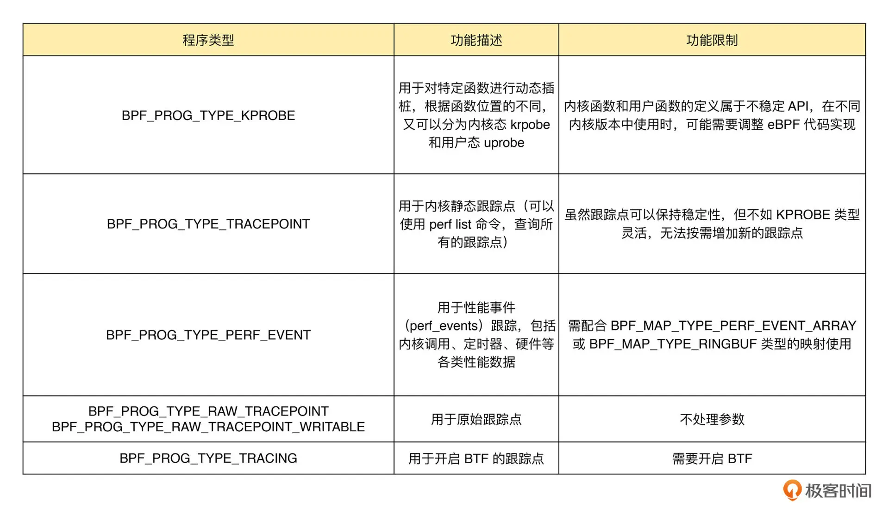

# ebpf程序

写代码就像打游戏，要先了结自己都有什么装备，如何使用，才能赢到最后。

## ebpf程序分类（到底该选哪把枪）

### 跟踪类（程序员的八倍镜）

<figure><figcaption></figcaption></figure>

* kprobe(kernel probe)是动态插桩，内核函数触发的时候执行bpf程序，可以设置是调用时执行还是结束返回时执行。实现原理是在指定函数的入口处的指令替换成跳转指令，跳转到kprobe函数钩子上，如果是多个函数会形成一个链，并把旧指令存起来，如果有函数就执行，如果没有函数再把指令替换回来。
* uprobe可以追踪用户态的程序。需要通过elf文件找到要跟踪的函数的地址，也同样是进行指令替换
* tracepoint是静态插桩，perf list可以查询所有的跟踪点。静态插桩是用代码写死的，需要人工维护的。

tracepoint的好处是它的跟踪点固定，而probe由于跟踪的是函数，函数的名称是有可能变动的，所以可能会出现程序或者内核升级之后之前开发的工具不能用了的现象，并且应用程序修改之后地址空间是会发生变化的，所以要动态的去获取要插桩的地址。

### 网络类

#### XDP程序（首当其冲冲锋枪）

XDP程序在网络驱动刚刚收到包的时候出发执行，无需通过繁杂的内核协议栈，所以经常被用来开发高性能的网络处理方案。XDP只能用来接收。

注意，网卡和网卡驱动并不一定原生就支持XDP，所以XDP有以下三种运行模式。

通用模式，不需要网卡和驱动支持，运行在内核中，性能较差。

原生模式，网卡驱动支持，在网卡驱动早起路径执行

卸载模式，需要网卡固件支持，XDP直接运行在网卡上，不消耗主机资源，性能最好。

最后的动作无非丢包，传到内核，转发到其他网卡，或者程序处理过程发现错误并丢包。

通过ip命令或者bcc库函数管理XDP程序

#### TC程序（中短距离步枪）

tc程序可以直接获取内核解析后的网路报文数据结构sk\_buff，并且在接收和发送两个方向上执行。

收包时，tc程序在网卡GRO之后，协议栈（IP层处理和ipatables等）处理之前。

发包时，tc程序在协议栈处理之后（IP层处理和ipatables等），网卡GSO之前。

tc运行在协议栈上，不需要网卡驱动做任何改动，可以挂载到任意网卡设备，包括虚拟设备上。

tc用tc工具。

```bash
# 创建 clsact 类型的排队规则
sudo tc qdisc add dev eth0 clsact

# 加载接收方向的 eBPF 程序
sudo tc filter add dev eth0 ingress bpf da obj tc-example.o sec ingress

# 加载发送方向的 eBPF 程序
sudo tc filter add dev eth0 egress bpf da obj tc-example.o sec egress
```

#### 套接字（该截胡的时候就截胡）

**过滤、观测或重定向套接字网络包**

**可以挂载到套接字（socket）、控制组（cgroup ）以及网络命名空间（netns）等各个位置。**

#### cgroup（我标记了一组敌人）

**cgroup 程序用于对 cgroup 内所有进程的网络过滤、套接字选项以及转发等进行动态控制，它最典型的应用场景是对容器中运行的多个进程进行网络控制。**

### **其他**

**todo**

### **资料**

推荐一篇文章[BPF 程序（BPF Prog）类型详解：使用场景、函数签名、执行位置及程序示例](https://arthurchiao.art/blog/bpf-advanced-notes-1-zh/)，讲解的比较详细

### **为什么需要这么多种类的程序**

看到这里，大家可能会有疑问，为什么需要这么多类型的程序？这个程序不就是一个函数吗，函数不是通用的吗？其实主要是挂载点的不同，比如下面两个一个是网络类挂载点，另一个是cgroup挂载点，


````cpp

struct net {
	//中间省略一些
	/* Used to store attached BPF programs */
	struct netns_bpf	bpf;
}
	

```

//挂载操作
net->bpf.progs[type] = prog;
````


```cpp

struct cgroup {
	//中间省略一些
	/* used to store eBPF programs */
	struct cgroup_bpf bpf;
};

//挂载操作
progs = &cgrp->bpf.progs[atype];
```

## 程序在内核中是如何表示的

程序在内核中是用如下结构体表示的

````c
// Some codeode
```cpp

struct bpf_prog {
	u16			pages;		/* Number of allocated pages */
	u16			jited:1,	/* Is our filter JIT'ed? */
				jit_requested:1,/* archs need to JIT the prog */
				gpl_compatible:1, /* Is filter GPL compatible? */
				cb_access:1,	/* Is control block accessed? */
				dst_needed:1,	/* Do we need dst entry? */
				blinding_requested:1, /* needs constant blinding */
				blinded:1,	/* Was blinded */
				is_func:1,	/* program is a bpf function */
				kprobe_override:1, /* Do we override a kprobe? */
				has_callchain_buf:1, /* callchain buffer allocated? */
				enforce_expected_attach_type:1, /* Enforce expected_attach_type checking at attach time */
				call_get_stack:1, /* Do we call bpf_get_stack() or bpf_get_stackid() */
				call_get_func_ip:1, /* Do we call get_func_ip() */
				tstamp_type_access:1, /* Accessed __sk_buff->tstamp_type */
				sleepable:1;	/* BPF program is sleepable */
	enum bpf_prog_type	type;		/* Type of BPF program */
	enum bpf_attach_type	expected_attach_type; /* For some prog types */
	u32			len;		/* Number of filter blocks */
	u32			jited_len;	/* Size of jited insns in bytes */
	u8			tag[BPF_TAG_SIZE];
	struct bpf_prog_stats __percpu *stats;
	int __percpu		*active;
	unsigned int		(*bpf_func)(const void *ctx,
					    const struct bpf_insn *insn);
	struct bpf_prog_aux	*aux;		/* Auxiliary fields */
	struct sock_fprog_kern	*orig_prog;	/* Original BPF program */
	/* Instructions for interpreter */
	union {
		DECLARE_FLEX_ARRAY(struct sock_filter, insns);
		DECLARE_FLEX_ARRAY(struct bpf_insn, insnsi);
	};
};
```
````

## 程序加载过程

这里我们不讨论加载的细节，只是大概说一下有哪些过程，一是为了让大家理解程序是如何加载进去的，二是开发过程中如果遇到什么问题可以快速锁定到问题出现在哪个步骤，然后再做具体排查。

1. 用户编译代码生成bpg.o文件
2. 用户态处理
   1. bpf\_object\_\_new创建并初始化obj结构体
      1. 读取elf文件节信息
      2. 依次读取各个section：btf/data/map
      3. 读取重定位信息
   2. bpf\_object\_\_load重定位修改bpf程序
      1. 读取内核模块相关的btf文件（vmlinux/kconfig/kallsysm）等，读取obj的btf，并做重定位修改
      2.  创建map这里最终调用了如下系统调用完成了map的创建

          ```c
          fd = sys_bpf_fd(BPF_MAP_CREATE, &attr, attr_sz);
          ```
      3. 最终调用系统调用sys\_bpf(BPF\_PROG\_LOAD, attr, size) 完成修改后的程序的加载，这一步会把
3. 内核态处理（sys\_bpf是总入口）
   1. 把之前处理好的程序拷贝到内核中
   2. 挂载程序
   3. 最后返回给用户态一个fd

对细节感兴趣的可以看看详细的函数调用栈，函数调用栈获取方法如下：

用户态函数栈：

这个函数栈很多，捡主要的看就行了



后面再写一篇详细的获取方法，主要是用了uftrace工具。

```bash
sudo uftrace -a --no-event tc > tc-uftrace-record
```

内核态函数栈：

主要看bpf\_prog\_load**。**


